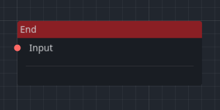

Quester is a C# based quest editor for Godot that utilizes nodes to create and manage quests in your game. Making it easier for not only game developers, but also designers to create engaging and immersive quests for their players.


# Features

- **Node-based Quest Editor**: Quester provides a visual interface where you can create quests using nodes.

- **Flexible Quest Structure**: Quester allows you to create quests with multiple branches and outcomes. You can define different paths and conditions for completing the quest, giving you full control over the quest's structure and progression.

- **Scripting with C#**: Quester is built using C#. You can write custom scripts to handle complex quest logic, interact with other game systems, and create dynamic quest experiences.

# Getting Started

To get started with Quester, follow these steps:

1. Download Quester.

2. Place the `addons/quester` folder in your Godot project directory.

3. Enable the Quester plugin in your project settings.

4. Explore the example quests provided in the project to get familiar with the node-based quest editor.

# Using the Condition and Action Nodes

Quester provides a condition and an action node that you can use to define the logic of your quests. A data manager is required to store the data of the quest. An example of a data manager is as follows:

```csharp
using Godot;
using Godot.Collections;

public partial class DataManager : Node
{
    // Data dictionary to store key-value pairs
    private Dictionary<string, Variant> _data = new Dictionary<string, Variant>();

    public override void _Ready()
    {
        // Register event handlers for condition queries
        QuestManager.Instance.ConditionQueryRequested += (string type, string key, Variant value, QuestCondition requester) =>
        {
            if (type == "variable")
            {
                if (CompareValue(key, value))
                {
                    requester.Completed = true;
                }
            }
        };

        // Register event handlers for action queries
        QuestManager.Instance.ActionQueryRequested += (string type, string key, Variant value, QuestAction requester) =>
        {
            if (type == "variable")
            {
                SetValue(key, value);
            }
        };
    }

    // Helper method to compare the value of a key with a given value
    private bool CompareValue(string key, Variant value)
    {
        if (value.VariantType == Variant.Type.Float)
        {
            return (float)value % 1 == 0 ? GetValue(key).Equals((int)value) : GetValue(key).Equals(value);
        }

        return GetValue(key).Equals(value);
    }

    // Helper method to set the value of a key
    public void SetValue(string key, Variant value)
    {
        if (_data.ContainsKey(key))
        {
            _data[key] = value;
        }
        else
        {
            _data.Add(key, value);
        }
    }

    // Helper method to get the value of a key
    public Variant GetValue(string key)
    {
        if (_data.ContainsKey(key))
        {
            return _data[key];
        }
        return new Variant();
    }
}
```
Using the data manager, you can use conditions and actions that interact with the data stored in the data manager. For example, scores, game progress, or player choices.

These conditions and actions can be used to create complex quest logic and interactions. And can be used by other systems in your game to create dynamic and engaging quests.

# Nodes

## Start Node


The start node is the entry point of the quest. It is where the quest begins and triggers the first set of actions or conditions.

Load a quest from resource and create an instance `quest = (QuestResource)Quest.Instantiate();` and start a quest using `QuestManager.Instance.StartQuest(quest);`. Which will trigger the start node of the selected quest.

The start of a quest triggers an event which can be listened to `QuestManager.Instance.QuestStarted += (QuestResource qr) => {};`.

## End Node


The end node is the exit point of the quest. It is where the quest ends and triggers the final set of actions or conditions.

The end of a quest triggers an event which can be listened to `QuestManager.Instance.QuestCompleted += (QuestResource qr) => {};`.

## Objective Node


The objective node represents a task or goal that the player needs to complete to progress the quest. It can have multiple outcomes and conditions that determine its completion.

When an object is created, it triggers an event which can be listened to `QuestManager.Instance.QuestObjectiveAdded += (QuestResource qr, QuestObjective qo) => {};`

Once an objective is completed, it triggers an event which can be listened to `QuestManager.Instance.QuestObjectiveCompleted += (QuestResource qr, QuestObjective qo) => {};`.

## Condition Node


The condition node checks if a specific condition is met before proceeding to the next node. It can have multiple outcomes based on the condition's result.

This node triggers an event which can be listened to `QuestManager.Instance.ConditionQueryRequested += (string type, string key, Variant value, QuestCondition requester) => {};`.

Set `requester.Completed = true;` if the condition is met.

## Action Node


The action node performs a specific action when triggered. It can have multiple outcomes based on the action's result.

This node triggers an event which can be listened to `QuestManager.Instance.ActionQueryRequested += (string type, string key, Variant value, QuestAction requester) => {};`.

# Starting a Quest

In order to start the quest from your code, you have to load the QuestResource you've created and instantiate it. Then you can start the quest using the QuestManager.

```csharp
public override void _Ready()
{
    // Load the quest resource
    QuestResource quest = (QuestResource)ResourceLoader.Load("res://quests/quest.tres");

    // Instantiate the quest
    quest = (QuestResource)Quest.Instantiate();

    // Start the quest
    QuestManager.Instance.StartQuest(quest);
}
```

# Observing Quest states

Quester exposes several signals to keep track of active quests and their states.

```csharp
ConditionQueryRequestedEventHandler(string type, string key, Variant value, QuestCondition requester);
ActionQueryRequestedEventHandler(string type, string key, Variant value, QuestAction requester);
QuestStartedEventHandler(QuestResource quest);
QuestObjectiveAddedEventHandler(QuestResource quest, QuestObjective objective);
QuestObjectiveCompletedEventHandler(QuestResource quest, QuestObjective objective);
QuestCompletedEventHandler(QuestResource quest);
```

# Quest utilities

You can get an Array of active and completed quests at any time, by using `QuestManager.Instance.GetQuests()` and `QuestManager.Instance.GetCompletedQuests()` respectively.

# Contributing

Contributions to Quester are welcome! If you have any bug reports, feature requests, or would like to contribute code, feel free to open an issue or submit a pull request.

# License

Quester is licensed under the MIT License. Feel free to use, modify, and distribute this software according to the terms of the license.

# Credits

Quester is inspired by [Questify](https://github.com/TheWalruzz/godot-questify), a GDScript-based quest editor for Godot.